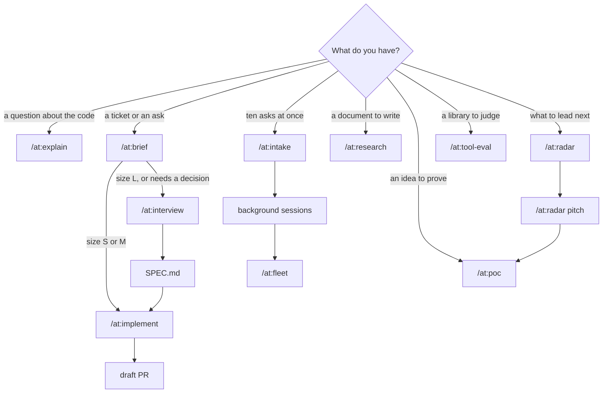
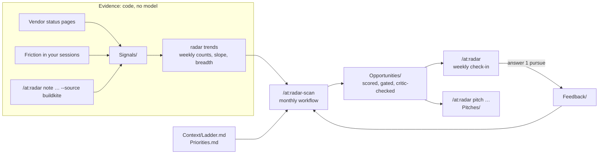

# claude

My Claude Code setup: global rules, a clean-code standard, and a plugin named `at` that holds the skills, agents and the clean-code gate, plus an optional radar that finds promotion-worthy projects to lead. Every skill runs as `/at:<skill>`, so none of them collide with other skills.

## Install, update, remove

Requires `uv` and `python3`. `npx` is optional; the gate uses it for the copy-paste check.

```sh
./install.sh                                  # everything except the radar
./install.sh --radar --vault ~/Notes/Radar    # everything, plus the radar with its vault in that folder
./uninstall.sh                                # removes everything and restores CLAUDE.md from the first backup
./uninstall.sh --radar                        # removes only the radar
```

Install backs up `settings.json` and `CLAUDE.md` once. Start a new Claude Code session, then run `claude plugin list` and look for `at@skills-dir … loaded`. To change anything, edit it here and run `./install.sh` again with the same flags. Skills and agents of your own in `~/.claude` are left alone.

The radar's vault folder is created if it doesn't exist, and opens in Obsidian as a vault. Uninstalling never deletes the vault or your notes; reinstalling without `--radar` stops the radar but keeps them too.

If your repos need gitignored files such as `.env` to build, list them in a `.worktreeinclude` file at the repo root (`.gitignore` syntax). Claude Code copies them into every worktree it creates, so background sessions start ready to build.

## How it fits together

| Layer | Installed to | Loaded | What it does |
| --- | --- | --- | --- |
| `CLAUDE.md` | `~/.claude/CLAUDE.md` | Every session | How to work and report: scope, evidence, done means checks pass, short replies |
| `rules/clean-code.md` | `~/.claude/rules/` | Every session | How to write code: reuse first, match the neighbours, small units, plain names, few comments |
| `at/` plugin | `~/.claude/skills/at/` | Skills on demand; hooks always | The skills below, the `at:worker` and `at:google-code-reviewer` agents, and the clean-gate hooks that check every edit |
| Radar (optional) | `~/.claude/skills/at/radar/` and your vault | Two session hooks; the rest on demand | Finds and pitches promotion-worthy projects from evidence; see [The radar](#the-radar) |

Only `/at:survey` and `/at:google-review` can start on their own when Claude thinks they fit. Every other skill runs only when you type it.

## Pick the skill



For one small ticket you'll watch yourself, `/at:ticket LIN-123` does it all in the current session. A radar pitch's POC goes to `/at:poc`, and once the project is agreed, `/at:interview` turns it into a spec for `/at:implement`.

## Skills

| Skill | Use it when | Runs on | You get |
| --- | --- | --- | --- |
| `/at:brief` | You have a Linear key or a short ask and want it sized | Opus, medium | `briefs/<id>.md`, sized S, M or L |
| `/at:interview` | The ask is part of a bigger problem, or needs decisions | Opus, high | `SPEC.md` covering what the ask didn't mention |
| `/at:research` | You need a one-pager (`--one-pager`), PRD (`--prd`) or design doc (`--design`) | Opus, high | A shareable artifact |
| `/at:design-doc` | You have a spec and want a design doc checked once for gaps | Opus, high | `DESIGN.md` |
| `/at:explain` | You want to know how something works, with `as: table \| list \| diagram \| prose \| doc` | Opus, high | An answer with file and line evidence |
| `/at:survey` | Before writing code: what exists, what to reuse, what to copy | Session model | A reuse map of up to 20 lines |
| `/at:implement` | A brief or spec is ready to build | Opus plans, Sonnet workers build | A draft PR |
| `/at:ticket` | One ticket, done in this session | Session model, high | A PR |
| `/at:intake` | A batch of asks to size and launch together | Session model, medium | Briefs, background sessions, a watch on them |
| `/at:dispatch` | Briefs are written and you want them running | Session model, low | One background session per brief |
| `/at:fleet` | Background sessions have finished | Session model, medium | Green PRs merged, failures relaunched once, questions for you |
| `/at:poc` | You want to prove an idea runs | Session model, high | A demo command, its output, and a README |
| `/at:tool-eval` | You're deciding whether to adopt a library | Session model, high | `evals/<tool>/EVAL.md` with a verdict |
| `/at:google-review` | You want a review of the current diff | Session model | Findings by `file:line`; you pick which to apply |
| `/at:word-salad` | A reply is too dense to read | Opus, medium | The same content in plain, short, ordered prose |
| `/at:radar` | Weekly check-in, a pitch, a note from any tool, or an answer | Opus, high | Ranked opportunities and pitches in your vault (only with `--radar`) |
| `/at:radar-scan` | Monthly, to find new opportunities in the evidence | Workflow, about 10 agents | `Opportunities/` notes, scored and critic-checked |

## Getting the best results

- **Start from a file, not a paragraph.** Skills read a brief or spec by path. Anything bigger than a one-line change goes through `/at:brief` first, and the size it picks sets the model and effort: S is Sonnet at medium, M is Sonnet at high, L goes to `/at:interview` or `/at:research`.
- **Let size set effort, not worry.** Raise effort only after a run fails for lack of it; `/at:fleet` does this itself, one level at a time. On the 5.5 models, medium already handles most multi-step coding.
- **Survey before you build.** `/at:implement` does this for you, but for work in your own session, run `/at:survey <what you're adding>` first. On terminator, asking for a "last edited 5m ago" label showed the label already existed (`NoteList.tsx:296`) and that `relativeTime` is copied, with different output, in two other files.
- **Read gate findings like review comments.** Fix each one, or say why it's intended. Known false positive: a test helper with the same name as a real function. Tune each repo with a `.clean-gate.json` (below).
- **Judge the PR by its first section.** Every PR from `/at:implement` opens with "How to read this change": the entry point, then each step in call order. If you can't follow it, ask for a rewrite before reading the code.
- **Done means the checks ran.** The PR carries each command and its exit code. A summary that says "tests pass" without output isn't done.
- **Too much to read?** Run `/at:word-salad` with no argument to rewrite the last reply, or pass it text or a file path.
- **One ask per session.** Start a new session between unrelated tasks, so old context doesn't steer the new one.
- **Give the radar your ladder first.** Until `Context/Ladder.md` holds your own next-level criteria, every promotion-fit score is provisional.
- **Feed the radar what you see at work.** Your sessions and status pages only show part of the picture; one line per finding (`/at:radar note "…" --source incident.io`) is how outages, slow builds and repeated asks from other teams get in.
- **Check in weekly, scan monthly.** `/at:radar` is cheap; `/at:radar-scan` runs about 10 agents, so run it when there's new evidence to read.
- **Answer every opportunity.** `pursue`, `park`, `reject` or `exists` is what tunes the next scan; an opportunity you never answer keeps coming back unchanged.

## The radar

The radar finds projects worth leading: months of work across several teams that make developers' lives measurably better, each mapped to the criteria for the level you're going for (staff to principal by default). It doesn't list PRs or to-dos.

### First-time setup

1. `./install.sh --radar --vault ~/Notes/Radar`, then open that folder in Obsidian as a vault.
2. Replace `Radar/Context/Ladder.md` with your ladder's next-level criteria and set `provisional: false`.
3. Add what leadership and your manager want focused on to `Radar/Context/Priorities.md`.
4. In `Radar Config.md`, add the status pages of tools your developers depend on to `status_pages`, and your team's areas to `out_of_scope` or `existing_programs` where someone else already owns them.
5. Use Claude as usual for a week, adding `/at:radar note` lines for what you notice at work, then run `/at:radar-scan` and `/at:radar`.

Example of what it's for: GitHub's status page logged 50 incidents between 2026-07-30 and 2026-10-07, 11 of them critical, and your own sessions hit `gh: HTTP 502` 30 times in 60 days. The radar turns that into an opportunity ("reduce dependence on github.com") and, when you ask, a pitch: options compared (self-hosting, GitLab, a mirror with CI fallback), a small POC that proves the leading option, milestones, risks and stakeholders.



| You do | What happens |
| --- | --- |
| Nothing | Each session's end is queued; tool errors that match `friction_patterns` (GitHub 502s by default) become signals. The first session of the day gets one line when a new opportunity appears. |
| `/at:radar note "p95 build time up 18% over 4 weeks" --source buildkite` | Adds what you saw at work, from any tool, linked to the tool, team or area it's about. This is how work evidence gets in. |
| `/at:radar-scan` | Monthly. A background workflow clusters the evidence into project hypotheses, drops anything out of scope, too small or already owned, researches the top three in parallel, scores them against your ladder, and has a separate critic check every number and argue the case against. Survivors become `Opportunities/` notes. It costs real tokens; `/workflows` shows them. |
| `/at:radar` | Weekly. Records sessions, pulls the sources, updates trends, and shows: what your feedback changed, the ranked opportunities, rising trends, blind spots (strong signal, few of your sessions), and what was held back. |
| `/at:radar pitch <opportunity>` | Writes the pitch in `Pitches/`: problem and trend, why now, options, POC, milestones by quarter, risks, stakeholders, ladder mapping, first two weeks. Every number must pass `radar verify`. |
| `/at:radar answer 1 pursue` | Steers the next scan: `pursue`, `park`, `reject`, `correction`, `exists` (adds to `existing_programs`), `out_of_scope`, `direction --until`, `weight --weight impact=0.4`, with `--who manager` for someone else's words. |

### What makes something an opportunity

Gates, all required: at least `min_weeks` of work (6), at least `min_teams` teams (2), at least `min_ladder_criteria` criteria from `Context/Ladder.md` (2), not out of scope or already owned. Then a rubric, each score backed by evidence: developer impact 0.3, org reach 0.2, technical direction 0.2, promotion fit 0.3 (weights live in the settings note). Confidence is the share of those scores backed by a measured trend rather than a note.

`Context/Ladder.md` starts with published principal-level expectations (GitLab's handbook, Dropbox's postings) and `provisional: true`. Replace it with your own ladder and set `provisional: false`; until then every promotion-fit score is marked provisional.

### No invented numbers

`radar verify <note>` is plain code: every number on a line of an opportunity or pitch must appear in a note linked on that same line. Dates, weeks, quarters, list numbers and durations like "6 weeks" are exempt. The scan and `pitch` both run it and fix what fails.

### The vault

```
<vault>/
├── Radar Config.md        settings, explained in the note itself
└── Radar/
    ├── Board.base         table of opportunities (open in Obsidian; click a column to sort)
    ├── Context/           Ladder.md, Priorities.md
    ├── Opportunities/     one note per project, scored, with evidence links
    ├── Pitches/           one pitch per opportunity you asked for
    ├── Signals/           status incidents, session friction, your notes
    ├── Entities/          tools, teams, areas, repos, with trend numbers
    ├── Themes/            groups of related signals, with trend numbers
    ├── Sessions/          one note per Claude session
    ├── Feedback/          your answers
    └── Briefs/            one check-in per week
```

The radar updates only the properties it writes and keeps text you add to a note, except session notes and the weekly check-in, which it rewrites. Prompts are kept to their first line and secrets are blanked before anything is written; if your vault syncs to the cloud, add private repos to `capture.skip_paths`.

Status pages are Atlassian Statuspage sites listed in `status_pages` (GitHub by default). Their API returns only the latest 50 incidents, so each pull keeps what it saw and trends grow longer than that.

## The clean-code gate

The gate runs after every edit and once when Claude finishes a turn. It sends its findings back to Claude, which fixes them before carrying on.

| Check | Rule |
| --- | --- |
| Size | A new function has at most 30 lines, complexity 10 and 3 parameters |
| Ratchet | A changed function that was already over a limit may not grow; untouched code is never reported |
| Repeated name | A new function's name isn't already defined in another tracked file |
| Comment run | No added comment longer than 3 lines, except a header at line 1 |
| Copy-paste | No block copied from elsewhere in the repo (end of turn only, needs `npx`) |

[lizard](https://github.com/terryyin/lizard) reads functions in 26 languages and [jscpd](https://github.com/kucherenko/jscpd) finds copies in 200+ formats. In a language lizard can't read, only the comment and copy-paste checks run.

An optional `.clean-gate.json` at a repo root changes the defaults for that repo:

```json
{
  "limits": { "nloc": 30, "ccn": 10, "params": 3, "commentRun": 3 },
  "ignoreNames": ["main", "__init__", "constructor", "App"],
  "ignorePaths": ["**/generated/**"]
}
```

To measure a branch: `uv run --script ~/.claude/skills/at/hooks/clean-gate/gate.py report main..HEAD`

The design behind all this: https://claude.ai/artifact/17jp31c5gsQX9JQQbvgd4i

## Tests

```sh
uv run --no-project --with pytest --with pyyaml --with lizard==1.24.1 pytest -q tests
bash tests/test_install.sh
uvx ruff check at tests && uvx ruff format --check at tests
claude plugin validate at
shellcheck -x install.sh uninstall.sh lib/radar.sh tests/test_install.sh at/bin/radar
```
