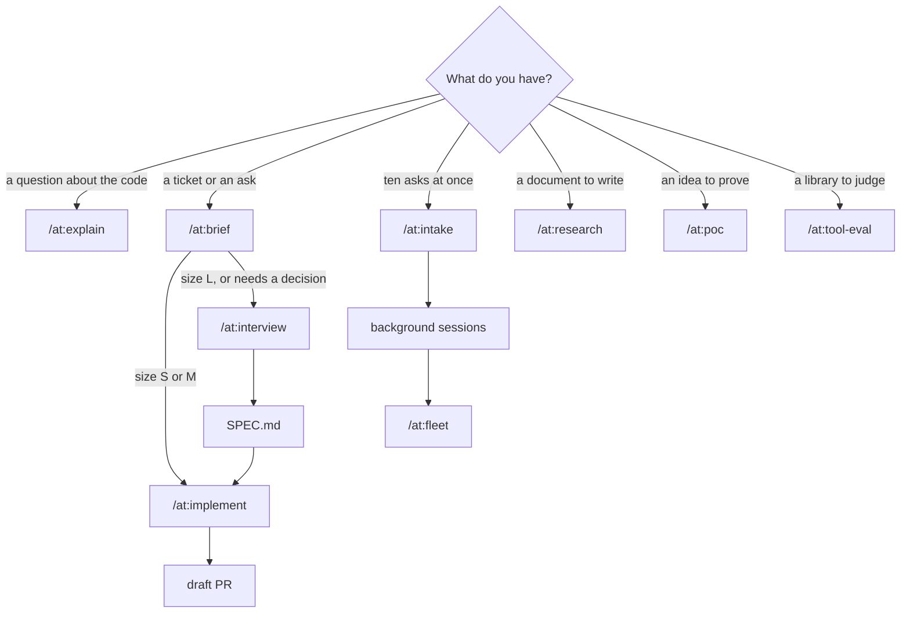
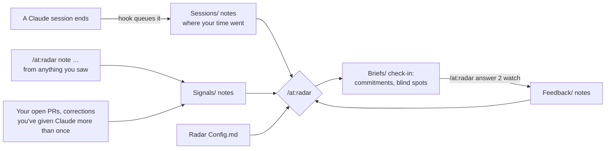

# claude

My Claude Code setup: global rules, a clean-code standard, and a plugin named `at` that holds the skills, agents and the clean-code gate. Every skill runs as `/at:<skill>`, so none of them collide with other skills.

## Install, update, remove

Requires `uv` and `python3`. `npx` is optional; the gate uses it for the copy-paste check.

```sh
./install.sh                                  # everything except the radar
./install.sh --radar --vault ~/Notes/Radar    # everything, plus the radar with its vault in that folder
./uninstall.sh                                # removes everything and restores CLAUDE.md from the first backup
./uninstall.sh --radar                        # removes only the radar
```

Install backs up `settings.json` and `CLAUDE.md` once. Start a new Claude Code session, then run `claude plugin list` and look for `at@skills-dir … loaded`. To change anything, edit it here and run `./install.sh` again with the same flags. Skills and agents of your own in `~/.claude` are left alone.

The radar's vault folder is created if it doesn't exist, and opens in Obsidian as a vault. Uninstalling never deletes the vault or your notes; reinstalling without `--radar` stops the radar but keeps them too.

If your repos need gitignored files such as `.env` to build, list them in a `.worktreeinclude` file at the repo root (`.gitignore` syntax). Claude Code copies them into every worktree it creates, so background sessions start ready to build.

## How it fits together

| Layer | Installed to | Loaded | What it does |
| --- | --- | --- | --- |
| `CLAUDE.md` | `~/.claude/CLAUDE.md` | Every session | How to work and report: scope, evidence, done means checks pass, short replies |
| `rules/clean-code.md` | `~/.claude/rules/` | Every session | How to write code: reuse first, match the neighbours, small units, plain names, few comments |
| `at/` plugin | `~/.claude/skills/at/` | Skills on demand; hooks always | The skills below, the `at:worker` and `at:google-code-reviewer` agents, and the clean-gate hooks that check every edit |
| Radar (optional) | `~/.claude/skills/at/radar/` and your vault | Two session hooks; the rest on demand | Records where your sessions go and finds blind spots; see [The radar](#the-radar) |

Only `/at:survey` and `/at:google-review` can start on their own when Claude thinks they fit. Every other skill runs only when you type it.

## Pick the skill



For one small ticket you'll watch yourself, `/at:ticket LIN-123` does it all in the current session.

## Skills

| Skill | Use it when | Runs on | You get |
| --- | --- | --- | --- |
| `/at:brief` | You have a Linear key or a short ask and want it sized | Opus, medium | `briefs/<id>.md`, sized S, M or L |
| `/at:interview` | The ask is part of a bigger problem, or needs decisions | Opus, high | `SPEC.md` covering what the ask didn't mention |
| `/at:research` | You need a one-pager (`--one-pager`), PRD (`--prd`) or design doc (`--design`) | Opus, high | A shareable artifact |
| `/at:design-doc` | You have a spec and want a design doc checked once for gaps | Opus, high | `DESIGN.md` |
| `/at:explain` | You want to know how something works, with `as: table \| list \| diagram \| prose \| doc` | Opus, high | An answer with file and line evidence |
| `/at:survey` | Before writing code: what exists, what to reuse, what to copy | Session model | A reuse map of up to 20 lines |
| `/at:implement` | A brief or spec is ready to build | Opus plans, Sonnet workers build | A draft PR |
| `/at:ticket` | One ticket, done in this session | Session model, high | A PR |
| `/at:intake` | A batch of asks to size and launch together | Session model, medium | Briefs, background sessions, a watch on them |
| `/at:dispatch` | Briefs are written and you want them running | Session model, low | One background session per brief |
| `/at:fleet` | Background sessions have finished | Session model, medium | Green PRs merged, failures relaunched once, questions for you |
| `/at:poc` | You want to prove an idea runs | Session model, high | A demo command, its output, and a README |
| `/at:tool-eval` | You're deciding whether to adopt a library | Session model, high | `evals/<tool>/EVAL.md` with a verdict |
| `/at:google-review` | You want a review of the current diff | Session model | Findings by `file:line`; you pick which to apply |
| `/at:word-salad` | A reply is too dense to read | Opus, medium | The same content in plain, short, ordered prose |
| `/at:radar` | You want your blind spots, or to note something you saw | Opus, medium | A check-in in chat and in your vault (only with `--radar`) |

## Getting the best results

- **Start from a file, not a paragraph.** Skills read a brief or spec by path. Anything bigger than a one-line change goes through `/at:brief` first, and the size it picks sets the model and effort: S is Sonnet at medium, M is Sonnet at high, L goes to `/at:interview` or `/at:research`.
- **Let size set effort, not worry.** Raise effort only after a run fails for lack of it; `/at:fleet` does this itself, one level at a time. On the 5.5 models, medium already handles most multi-step coding.
- **Survey before you build.** `/at:implement` does this for you, but for work in your own session, run `/at:survey <what you're adding>` first. On terminator, asking for a "last edited 5m ago" label showed the label already existed (`NoteList.tsx:296`) and that `relativeTime` is copied, with different output, in two other files.
- **Read gate findings like review comments.** Fix each one, or say why it's intended. Known false positive: a test helper with the same name as a real function. Tune each repo with a `.clean-gate.json` (below).
- **Judge the PR by its first section.** Every PR from `/at:implement` opens with "How to read this change": the entry point, then each step in call order. If you can't follow it, ask for a rewrite before reading the code.
- **Done means the checks ran.** The PR carries each command and its exit code. A summary that says "tests pass" without output isn't done.
- **Too much to read?** Run `/at:word-salad` with no argument to rewrite the last reply, or pass it text or a file path.
- **One ask per session.** Start a new session between unrelated tasks, so old context doesn't steer the new one.

## The radar

A blind spot is something with strong signal that's getting little of your attention. The radar measures attention from your own Claude sessions and signal from your notes and the sources you turn on, and keeps everything as linked notes in an Obsidian vault.



| You do | What happens |
| --- | --- |
| Nothing | When a session ends, a hook queues it. When the first session of the day starts, one line appears if anything is open. |
| `/at:radar` | Reads the queued sessions, pulls the sources, finds blind spots, writes this week's note in `Briefs/`, and shows it. |
| `/at:radar note "p95 build time up 18%" --source buildkite` | Adds what you noticed, from Buildkite, incident.io, a work Linear issue, Slack or anywhere else, linked to the repo or area it's about. |
| `/at:radar answer 2 watch` | Records your answer: `act`, `watch` (raise it again only if it grows), `known` (quiet until it grows) or `out_of_scope`. |

Only two steps use a model: linking a note you wrote, and presenting the check-in. Recording sessions, counting and finding blind spots are plain code.

### What it looks for

| Finds | Example |
| --- | --- |
| Open PRs nobody has touched, grouped by repo | "51 PRs open, oldest 142 days: terminator" |
| Repos with signals but no sessions lately | "effects-controller: signals but no sessions in 14 days" |
| Corrections you've given Claude in several projects | "Told Claude 3 times: check-pr-merged-before-pushing" |
| Work a session reported as not done that no later session picked up | "Left not done: The gate still wrongly reports a test helper that shares a name with a real function" |
| Lots of signal, few sessions | "foundry-live-check: 23 open signals, 0 sessions in 30 days" |
| Something you said to watch that has grown since | its title, with "Grew since you said watch" |

Open PRs come first, as commitments. After them come at most three blind spots, numbered on from the commitments.

### The vault

```
<vault>/
├── Radar Config.md     settings: edit them here
└── Radar/
    ├── Sessions/       one note per Claude session
    ├── Signals/        your notes, open PRs, repeated corrections
    ├── Entities/       repos, areas, people and projects the notes link to
    ├── Themes/         groups of related signals
    ├── Blind spots/    one note per blind spot, with its evidence and status
    ├── Feedback/       your answers
    └── Briefs/         one check-in per week
```

Notes link to each other through their properties, so Obsidian's graph view shows how evidence connects to each blind spot. You can add links or text to any note; the radar only updates the properties it writes and keeps your text. The exceptions are session notes and the weekly check-in, which it rewrites.

`Radar Config.md` holds every setting, with an explanation of each in the note itself: how much of each prompt to keep (the first line, by default), repos never to record, which sources to pull, the thresholds above, how many blind spots to show, the session-start reminder, your priorities and topics never to raise. Edit it in Obsidian; the next check-in uses it.

Prompts are kept to their first line, and tokens, keys and passwords are blanked before anything is written. If your vault syncs to the cloud, consider adding private repos to `skip_paths`.

## The clean-code gate

The gate runs after every edit and once when Claude finishes a turn. It sends its findings back to Claude, which fixes them before carrying on.

| Check | Rule |
| --- | --- |
| Size | A new function has at most 30 lines, complexity 10 and 3 parameters |
| Ratchet | A changed function that was already over a limit may not grow; untouched code is never reported |
| Repeated name | A new function's name isn't already defined in another tracked file |
| Comment run | No added comment longer than 3 lines, except a header at line 1 |
| Copy-paste | No block copied from elsewhere in the repo (end of turn only, needs `npx`) |

[lizard](https://github.com/terryyin/lizard) reads functions in 26 languages and [jscpd](https://github.com/kucherenko/jscpd) finds copies in 200+ formats. In a language lizard can't read, only the comment and copy-paste checks run.

An optional `.clean-gate.json` at a repo root changes the defaults for that repo:

```json
{
  "limits": { "nloc": 30, "ccn": 10, "params": 3, "commentRun": 3 },
  "ignoreNames": ["main", "__init__", "constructor", "App"],
  "ignorePaths": ["**/generated/**"]
}
```

To measure a branch: `uv run --script ~/.claude/skills/at/hooks/clean-gate/gate.py report main..HEAD`

The design behind all this: https://claude.ai/artifact/17jp31c5gsQX9JQQbvgd4i

## Tests

```sh
uv run --no-project --with pytest --with pyyaml --with lizard==1.24.1 pytest -q tests
bash tests/test_install.sh
uvx ruff check at tests && uvx ruff format --check at tests
claude plugin validate at
shellcheck -x install.sh uninstall.sh lib/radar.sh tests/test_install.sh at/bin/radar
```
