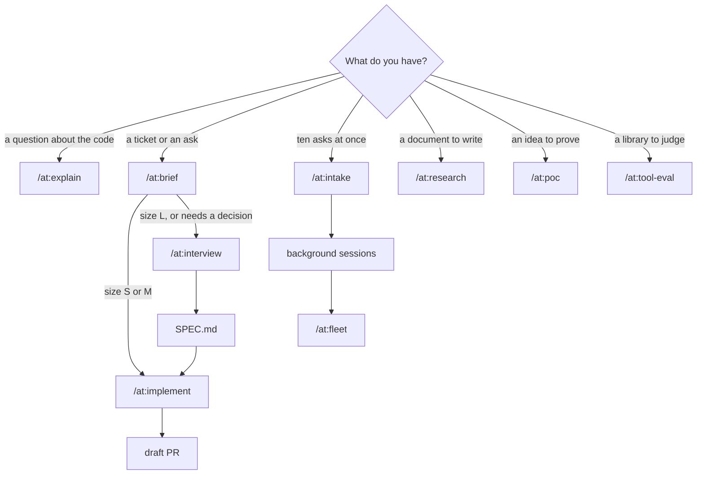

# claude

My Claude Code setup: global rules, a clean-code standard, and a plugin named `at` that holds the skills, agents and the clean-code gate. Every skill runs as `/at:<skill>`, so none of them collide with other skills.

## Install, update, remove

Requires `uv` and `python3`. `npx` is optional; the gate uses it for the copy-paste check.

```sh
./install.sh     # backs up settings.json and CLAUDE.md once, then installs everything
./uninstall.sh   # removes the plugin and rules, and restores CLAUDE.md from that first backup
```

Start a new Claude Code session, then run `claude plugin list` and look for `at@skills-dir … loaded`. To change anything, edit it here and run `./install.sh` again. Skills and agents of your own in `~/.claude` are left alone.

## How it fits together

| Layer | Installed to | Loaded | What it does |
| --- | --- | --- | --- |
| `CLAUDE.md` | `~/.claude/CLAUDE.md` | Every session | How to work and report: scope, evidence, done means checks pass, short replies |
| `rules/clean-code.md` | `~/.claude/rules/` | Every session | How to write code: reuse first, match the neighbours, small units, plain names, few comments |
| `at/` plugin | `~/.claude/skills/at/` | Skills on demand; hooks always | The skills below, the `at:worker` and `at:google-code-reviewer` agents, and the clean-gate hooks that check every edit |

Only `/at:survey` and `/at:google-review` can start on their own when Claude thinks they fit. Every other skill runs only when you type it.

## Pick the skill



For one small ticket you'll watch yourself, `/at:ticket LIN-123` does it all in the current session.

## Skills

| Skill | Use it when | Runs on | You get |
| --- | --- | --- | --- |
| `/at:brief` | You have a Linear key or a short ask and want it sized | Opus, medium | `briefs/<id>.md`, sized S, M or L |
| `/at:interview` | The ask is part of a bigger problem, or needs decisions | Opus, high | `SPEC.md` covering what the ask didn't mention |
| `/at:research` | You need a one-pager (`--one-pager`), PRD (`--prd`) or design doc (`--design`) | Opus, high | A shareable artifact |
| `/at:design-doc` | You have a spec and want a design doc checked once for gaps | Opus, high | `DESIGN.md` |
| `/at:explain` | You want to know how something works, with `as: table \| list \| diagram \| prose \| doc` | Opus, high | An answer with file and line evidence |
| `/at:survey` | Before writing code: what exists, what to reuse, what to copy | Session model | A reuse map of up to 20 lines |
| `/at:implement` | A brief or spec is ready to build | Opus plans, Sonnet workers build | A draft PR |
| `/at:ticket` | One ticket, done in this session | Session model, high | A PR |
| `/at:intake` | A batch of asks to size and launch together | Session model, medium | Briefs, background sessions, a watch on them |
| `/at:dispatch` | Briefs are written and you want them running | Session model, low | One background session per brief |
| `/at:fleet` | Background sessions have finished | Session model, medium | Green PRs merged, failures relaunched once, questions for you |
| `/at:poc` | You want to prove an idea runs | Session model, high | A demo command, its output, and a README |
| `/at:tool-eval` | You're deciding whether to adopt a library | Session model, high | `evals/<tool>/EVAL.md` with a verdict |
| `/at:google-review` | You want a review of the current diff | Session model | Findings by `file:line`; you pick which to apply |
| `/at:word-salad` | A reply is too dense to read | Opus, medium | The same content in plain, short, ordered prose |

## Getting the best results

- **Start from a file, not a paragraph.** Skills read a brief or spec by path. Anything bigger than a one-line change goes through `/at:brief` first, and the size it picks sets the model and effort: S is Sonnet at medium, M is Sonnet at high, L goes to `/at:interview` or `/at:research`.
- **Let size set effort, not worry.** Raise effort only after a run fails for lack of it; `/at:fleet` does this itself, one level at a time. On the 5.5 models, medium already handles most multi-step coding.
- **Survey before you build.** `/at:implement` does this for you, but for work in your own session, run `/at:survey <what you're adding>` first. On terminator, asking for a "last edited 5m ago" label showed the label already existed (`NoteList.tsx:296`) and that `relativeTime` is copied, with different output, in two other files.
- **Read gate findings like review comments.** Fix each one, or say why it's intended. Known false positive: a test helper with the same name as a real function. Tune each repo with a `.clean-gate.json` (below).
- **Judge the PR by its first section.** Every PR from `/at:implement` opens with "How to read this change": the entry point, then each step in call order. If you can't follow it, ask for a rewrite before reading the code.
- **Done means the checks ran.** The PR carries each command and its exit code. A summary that says "tests pass" without output isn't done.
- **Too much to read?** Run `/at:word-salad` with no argument to rewrite the last reply, or pass it text or a file path.
- **One ask per session.** Start a new session between unrelated tasks, so old context doesn't steer the new one.

## The clean-code gate

The gate runs after every edit and once when Claude finishes a turn. It sends its findings back to Claude, which fixes them before carrying on.

| Check | Rule |
| --- | --- |
| Size | A new function has at most 30 lines, complexity 10 and 3 parameters |
| Ratchet | A changed function that was already over a limit may not grow; untouched code is never reported |
| Repeated name | A new function's name isn't already defined in another tracked file |
| Comment run | No added comment longer than 3 lines, except a header at line 1 |
| Copy-paste | No block copied from elsewhere in the repo (end of turn only, needs `npx`) |

[lizard](https://github.com/terryyin/lizard) reads functions in 26 languages and [jscpd](https://github.com/kucherenko/jscpd) finds copies in 200+ formats. In a language lizard can't read, only the comment and copy-paste checks run.

An optional `.clean-gate.json` at a repo root changes the defaults for that repo:

```json
{
  "limits": { "nloc": 30, "ccn": 10, "params": 3, "commentRun": 3 },
  "ignoreNames": ["main", "__init__", "constructor", "App"],
  "ignorePaths": ["**/generated/**"]
}
```

To measure a branch: `uv run --script ~/.claude/skills/at/hooks/clean-gate/gate.py report main..HEAD`

The design behind all this: https://claude.ai/artifact/17jp31c5gsQX9JQQbvgd4i

## Tests

```sh
uv run --no-project --with pytest --with lizard==1.24.1 pytest -q tests
bash tests/test_install.sh
uvx ruff check at tests && uvx ruff format --check at tests
claude plugin validate at
shellcheck install.sh uninstall.sh tests/test_install.sh
```
