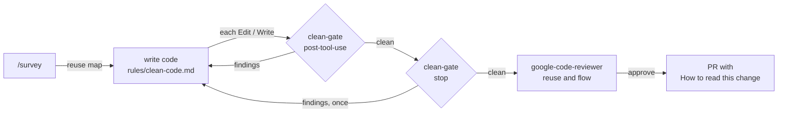

# claude

My Claude Code setup: global instructions, skills, agents, and the clean-code gate. One script installs all of it into `~/.claude`.

## Install

Requires `uv` and `python3`; `npx` is optional (used for the copy-paste check).

```sh
./install.sh     # backs up settings.json and CLAUDE.md once, then copies everything below
./uninstall.sh   # removes what install added and restores CLAUDE.md from the first backup
```

Start a new Claude Code session and run `/hooks` to confirm. Re-run `./install.sh` after editing anything here. Skills and agents already in `~/.claude` that are not in this repo are left alone.

## What it installs

| From | To `~/.claude/` | What it is |
| --- | --- | --- |
| `CLAUDE.md` | `CLAUDE.md` | Operating rules for every session |
| `rules/clean-code.md` | `rules/` | The clean-code standard, loaded in every session |
| `skills/*/` | `skills/` | The skills listed below |
| `agents/*.md` | `agents/` | `worker` (builds one unit for `/implement`) and `google-code-reviewer` |
| `hooks/clean-gate/` | `hooks/clean-gate/` | Checks each edit and each finished turn |
| (generated) | `settings.json` | Two hooks: `PostToolUse` on `Edit\|Write\|MultiEdit` and `Stop`. Existing settings and hooks are kept. |

## Skills

| Skill | Use it to |
| --- | --- |
| `/brief` | Turn a Linear key or a quick prompt into a brief sized to the work |
| `/intake` | Size, brief and dispatch a whole batch of asks at once |
| `/interview` | Clarify an ask until nothing is ambiguous, then write the spec |
| `/research` | Write a one-pager (`--one-pager`), PRD (`--prd`) or design document (`--design`), published as an artifact |
| `/design-doc` | Draft a design document from a spec and have it gap-reviewed once |
| `/explain` | Answer a question about the codebase in the format asked for |
| `/survey` | Map the flow, the code to reuse and the example to copy before writing code |
| `/implement` | Plan on Opus, build with Sonnet workers, end in a PR |
| `/ticket` | Do one Linear ticket end to end in this session |
| `/poc` | Build a proof of concept with a runnable demonstration |
| `/tool-eval` | Evaluate a tool or library against fixed criteria |
| `/dispatch` | Launch briefs as background sessions |
| `/fleet` | Triage background sessions, merge green PRs, re-dispatch failures |
| `/google-review` | Review the current diff against Google's code review standard |

## Readable by default

Design: https://claude.ai/artifact/17jp31c5gsQX9JQQbvgd4i



`/implement` runs the survey before planning, gives each worker the Reuse and Shape lines it needs, runs the reviewer before shipping, and starts the PR body with "How to read this change".

| Gate check | Rule |
| --- | --- |
| Size | A new function has at most 30 lines, complexity 10 and 3 parameters. |
| Ratchet | A changed function that was already over a limit may not grow. Untouched code is never reported. |
| Repeated name | A new function's name is not already defined in another tracked file. |
| Comment run | No added comment longer than 3 lines, except a header at line 1. |
| Copy-paste | No clone between a changed file and the rest of the repo (stop hook only, needs `npx`). |

Functions are read by [lizard](https://github.com/terryyin/lizard) (26 languages); copy-paste by [jscpd](https://github.com/kucherenko/jscpd). In other languages only the comment and copy-paste checks run.

An optional `.clean-gate.json` at a repo root overrides the defaults:

```json
{
  "limits": { "nloc": 30, "ccn": 10, "params": 3, "commentRun": 3 },
  "ignoreNames": ["main", "__init__", "constructor", "App"],
  "ignorePaths": ["**/generated/**"]
}
```

Measure a branch: `uv run --script ~/.claude/hooks/clean-gate/gate.py report main..HEAD`

## Tests

```sh
uv run --no-project --with pytest --with lizard==1.24.1 pytest -q tests
bash tests/test_install.sh
uvx ruff check hooks tests && uvx ruff format --check hooks tests
shellcheck install.sh uninstall.sh tests/test_install.sh
```
